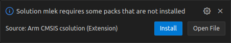
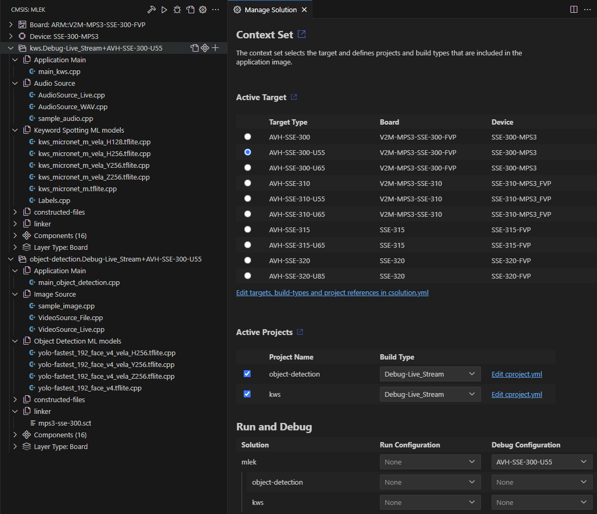

[](https://github.com/Arm-Examples/mlek-cmsis-pack-examples/blob/main/LICENSE)
[](/.github/workflows/AVH-FVP-CI.yml)
[](./.github/workflows/Hardware-CI.yml)

# CMSIS-Pack based Machine Learning Examples

- [CMSIS-Pack based Machine Learning Examples](#cmsis-pack-based-machine-learning-examples)
- [Introduction](#introduction)
  - [Examples](#examples)
  - [Target platforms](#target-platforms)
- [Overview](#overview)
  - [Object detection](#object-detection)
  - [Keyword spotting](#keyword-spotting)
- [Prerequisites](#prerequisites)
  - [Visual Studio Code](#visual-studio-code)
  - [Packs](#packs)
  - [Virtual Streaming Interface](#virtual-streaming-interface)
- [Building the examples](#building-the-examples)
  - [Launch project in Visual Studio Code](#launch-project-in-visual-studio-code)
  - [Download Software Packs](#download-software-packs)
  - [Generate and build the project](#generate-and-build-the-project)
    - [Available Contexts](#available-contexts)
    - [Build](#build)
  - [Execute Project on Arm Virtual Hardware](#execute-project-on-arm-virtual-hardware)
- [Application output](#application-output)
- [Add Hardware Targets](#add-hardware-targets)
  - [Add Alif Ensemble AI/ML AppKit Board Target](#add-alif-ensemble-aiml-appkit-board-target)
- [Trademarks](#trademarks)
- [Licenses](#licenses)
- [Troubleshooting and known issues](#troubleshooting-and-known-issues)

# Introduction

This repository contains Machine Learning (ML) examples using the CMSIS-Pack from
[ML Embedded Evaluation Kit](https://review.mlplatform.org/plugins/gitiles/ml/ethos-u/ml-embedded-evaluation-kit/+/refs/heads/main).

## Examples

Currently, the following examples are supported:

- **Object detection** - detects objects in the input image.
- **Keyword spotting** - detects specific keywords in the input audio stream.

## Target platforms

Target platforms supported:

| Name                         | Type                | IP                                            | Examples |
|------------------------------|---------------------|-----------------------------------------------|----------|
| Arm® Corstone™-300           | Virtual or physical | Arm® Cortex®-M55 CPU                          | All      |
| Arm® Corstone™-300-U55       | Virtual or physical | Arm® Cortex®-M55 CPU with Arm® Ethos™-U55     | All      |
| Arm® Corstone™-300-U65       | Virtual or physical | Arm® Cortex®-M55 CPU with Arm® Ethos™-U65     | All      |
| Arm® Corstone™-310           | Virtual or physical | Arm® Cortex®-M85 CPU                          | All      |
| Arm® Corstone™-310-U55       | Virtual or physical | Arm® Cortex®-M85 CPU with Arm® Ethos™-U55     | All      |
| Arm® Corstone™-310-U65       | Virtual or physical | Arm® Cortex®-M85 CPU with Arm® Ethos™-U65 NPU | All      |
| Arm® Corstone™-315           | Virtual or physical | Arm® Cortex®-M85 CPU                          | All      |
| Arm® Corstone™-315-U65       | Virtual or physical | Arm® Cortex®-M85 CPU with Arm® Ethos™-U65 NPU | All      |
| Arm® Corstone™-320           | Virtual or physical | Arm® Cortex®-M85 CPU                          | All      |
| Arm® Corstone™-320-U85       | Virtual or physical | Arm® Cortex®-M85 CPU with Arm® Ethos™-U85 NPU | All      |

Use this import button to open the solution in Keil Studio Cloud: [![Open in Keil Studio](https://img.shields.io/badge/Keil%20Studio-Import-blue?logo=data:image/svg+xml;base64,PD94bWwgdmVyc2lvbj0iMS4wIiBlbmNvZGluZz0idXRmLTgiPz4NCjwhLS0gR2VuZXJhdG9yOiBBZG9iZSBJbGx1c3RyYXRvciAyNS40LjEsIFNWRyBFeHBvcnQgUGx1Zy1JbiAuIFNWRyBWZXJzaW9uOiA2LjAwIEJ1aWxkIDApICAtLT4NCjxzdmcgdmVyc2lvbj0iMS4xIiBpZD0iTGF5ZXJfMSIgeG1sbnM9Imh0dHA6Ly93d3cudzMub3JnLzIwMDAvc3ZnIiB4bWxuczp4bGluaz0iaHR0cDovL3d3dy53My5vcmcvMTk5OS94bGluayIgeD0iMHB4IiB5PSIwcHgiDQoJIHZpZXdCb3g9IjAgMCA0NyAxNCIgc3R5bGU9ImVuYWJsZS1iYWNrZ3JvdW5kOm5ldyAwIDAgNDcgMTQ7IiB4bWw6c3BhY2U9InByZXNlcnZlIj4NCjxzdHlsZSB0eXBlPSJ0ZXh0L2NzcyI+DQoJLnN0MHtmaWxsOiNGRkZGRkY7fQ0KPC9zdHlsZT4NCjxwYXRoIGNsYXNzPSJzdDAiIGQ9Ik00LjcsN2MwLDIuMiwxLjQsNC4xLDMuNSw0LjFjMS44LDAsMy42LTEuNCwzLjYtNC4xYzAtMi44LTEuNy00LjItMy42LTQuMkM2LjIsMi45LDQuNyw0LjcsNC43LDcgTTExLjYsMC41DQoJaDIuOXYxM2gtMi45di0xLjNjLTAuOSwxLjEtMi4zLDEuNy0zLjcsMS43QzQsMTMuOSwxLjgsMTAuNiwxLjgsN2MwLTQuMywyLjctNi45LDYuMS02LjljMS41LDAsMi44LDAuNywzLjcsMS45VjAuNXoiLz4NCjxwYXRoIGNsYXNzPSJzdDAiIGQ9Ik0xOCwwLjVIMjF2MS4yYzAuMy0wLjQsMC43LTAuOCwxLjItMS4xYzAuNS0wLjMsMS4yLTAuNCwxLjctMC40YzAuOCwwLDEuNiwwLjIsMi4zLDAuNmwtMS4yLDIuOA0KCWMtMC40LTAuMy0xLTAuNC0xLjUtMC40Yy0wLjctMC4xLTEuMywwLjItMS44LDAuN0MyMSw0LjYsMjEsNS45LDIxLDYuOHY2LjdIMThWMC41eiIvPg0KPHBhdGggY2xhc3M9InN0MCIgZD0iTTI4LjIsMC41aDIuOXYxLjJjMC43LTAuOSwxLjktMS42LDMuMS0xLjZjMS4zLDAsMi42LDAuNywzLjIsMS45YzAuOS0xLjIsMi4yLTEuOSwzLjctMS45DQoJQzQyLjcsMCw0NCwwLjksNDQuNywyLjJjMC4yLDAuNCwwLjcsMS40LDAuNywzLjN2OC4xaC0yLjlWNi4zYzAtMS41LTAuMi0yLjEtMC4yLTIuM2MtMC4yLTAuNy0wLjktMS4yLTEuNy0xLjENCgljLTAuNywwLTEuMywwLjMtMS43LDAuOWMtMC41LDAuOC0wLjYsMS45LTAuNiwyLjl2Ni43aC0yLjlWNi4zYzAtMS41LTAuMi0yLjEtMC4yLTIuM2MtMC4yLTAuNy0wLjktMS4yLTEuNy0xLjENCgljLTAuNywwLTEuMywwLjMtMS43LDAuOWMtMC41LDAuOC0wLjYsMS45LTAuNiwyLjl2Ni43aC0yLjlMMjguMiwwLjV6Ii8+DQo8L3N2Zz4NCg==&logoWidth=47)](https://studio.keil.arm.com/?import=https://github.com/Arm-Examples/mlek-cmsis-pack-examples.git)

# Overview

The examples presented in this repository showcase how to build and deploy end-to-end Machine
Learning applications using existing code from various CMSIS-packs. These examples are built
using Google's [TensorFlow Lite Micro framework](https://www.tensorflow.org/lite/microcontrollers)
and Arm's [ML Embedded Evaluation Kit](https://review.mlplatform.org/plugins/gitiles/ml/ethos-u/ml-embedded-evaluation-kit/+/refs/heads/main/Readme.md)
API's. The embedded evaluation kit API pack has ready-to-use machine learning API's for several
use cases covering typical `voice`, `vibration` and `vision` applications.

Although the primary target platforms for this repository are Arm® Corstone™-300 and Corstone™-310,
the Keyword spotting (KWS) project can be built for physical targets too. The examples are set
up to use the NPU (if available) by default with unsupported operators falling back on the CPU.
Therefore, the neural network model files used for Corstone™-300 and Corstone™-310 have been
pre-optimised by the [Vela compiler](https://pypi.org/project/ethos-u-vela/) while the files
used for pure CPU targets are used as they are.

## Object detection

This example uses a neural network model that specialises in detecting human faces in images.
The input size for these images is 192x192 (monochrome) and the smallest face that can be
detected is of size 20x20. The output of the application will be co-ordinates for rectangular
bounding boxes for each detection.

## Keyword spotting

This example can detect up to twelve keywords in the input audio stream. The
[audio file used](./resources/sample_audio.wav) contains the keyword "down" being spoken.

More details about the input for this example can be found [here](https://review.mlplatform.org/plugins/gitiles/ml/ethos-u/ml-embedded-evaluation-kit/+/refs/heads/main/docs/use_cases/kws.md#preprocessing-and-feature-extraction).

# Prerequisites

## Visual Studio Code

We recommend using [Visual Studio Code IDE](https://code.visualstudio.com/) with the
[Keil Studio Pack Extension](https://marketplace.visualstudio.com/items?itemName=Arm.keil-studio-pack).
Alternatively, [Keil Studio Cloud](https://studio.keil.arm.com/?import=https://github.com/Arm-Examples/mlek-cmsis-pack-examples.git) can also be used.

Once the IDE has been set up with the extension, it presents an easy to use interface to build
applications for specific configurations of the different projects and targets from within VS Code,
and also helps with debugging and flashing.

For developing on a local host machine, we recommend a Linux based system as we test
the flow of the instructions in that environment, but a Windows based machine should
also work.

## Packs

CMSIS-Pack defines a standardized way to deliver software components, device parameters and board
support information and code. A list of available CMSIS-Packs can be found
[here](https://developer.arm.com/tools-and-software/embedded/cmsis/cmsis-packs).

## Virtual Streaming Interface

[Virtual Streaming Interface)](https://arm-software.github.io/AVH/main/simulation/html/group__arm__vsi.html)
(VSI) is available for certain
[Fixed Virtual Platform](https://developer.arm.com/Tools%20and%20Software/Fixed%20Virtual%20Platforms) (FVP) or
[Arm Virtual Hardware](https://developer.arm.com/Tools%20and%20Software/Arm%20Virtual%20Hardware) (AVH)
targets. CMSIS-Pack based ML examples use VSI for audio and video streaming and to execute the examples on FVP
targets the below dependencies must be installed.

For more details and up-to-date requirements, see
[Python environment setup](https://arm-software.github.io/AVH/main/simulation/html/group__arm__vsi__pyenv.html)
which mentions:

> The following packages are required on Linux systems (Ubuntu 20.04 and later):
>   - libatomic1
>   - python3.9
>   - python3-pip

In addition to the above, the VSI Python scripts depend on `opencv-python` package. We recommend using
a virtual environment and installing this with pip.

```shell
$ pip install opencv-python "numpy<2.0.0"
```

**NOTE**: The requirement for Python version is driven by the FVP executable. Versions <= 11.28 require
Python3.9 but this may change for future releases.

# Building the examples

## Launch project in Visual Studio Code

Upon opening the project in Visual Studio Code, `vcpkg` will automatically install the required packages as specified in
the manifest file [vcpkg-configuration.json](vcpkg-configuration.json). These may include the FVP binaries.

## Download Software Packs

Once `vcpkg` has finished configuring the environment, a prompt will appear to install the required CMSIS packs for this project:



Recent versions of CMSIS toolbox will automatically install the missing packs when a project is built.

Alternatively, the packs can be installed manually be opening up a Terminal in Visual Studio Code (Ctrl + Shift + `) and running the following commands:

```shell
csolution list packs -s mlek.csolution.yml -m > packlist.txt
```

```shell
cpackget add -f packlist.txt
```

## Generate and build the project

Use the CMSIS tab in the Activity Bar to build, run and debug the use case samples for a particular target type.



### Available Contexts

Besides having multiple Target Types to select from, one must also select appropriate Build Type depending on target capabilities.

- ***-Live_Stream** build type uses VSI Audio and VSI Video to capture inference samples (either audio or image sample)
- ***-Data_Array** build type takes audio or image sample data from predefined static array variable

All AVH targets support both build types.

The object detection example, when build for **-Live_Stream** context, uses VSI Video to read images from
a camera connected to your host machine and streams these over to the application running within the FVP.
Similarly, keyword spotting example, when build for **-Live_Stream** context, uses VSI Audio to read audio
from a wav file stored on your host machine and streams audio samples to the application running within
the FVP.

### Build

Simply use the drop-down menus to specify your build, then click the `Build solution` button.

The build output should look similar to the following:

```log
 *  Executing task: cmsis-csolution.build: Build 

Execute: cbuild c:\...\mlek-cmsis-pack-examples\mlek.csolution.yml --context-set --packs
+---------------------------------------------------------------------------
(1/1) Building context: "object-detection.Debug-Live_Stream+AVH-SSE-300-U55"
Using AC6 V6.23.0 compiler, from: 'c:/.../.vcpkg/artifacts/2139c4c6/compilers.arm.armclang/6.23.0/bin/'
Building CMake target 'object-detection.Debug-Live_Stream+AVH-SSE-300-U55'
[1/323] Building C object CMakeFiles/Group_Board.dir/C_/.../mlek-cmsis-pack-examples/board/Corstone-300/uart_cmsdk_apb.o
[2/323] Building C object CMakeFiles/Group_Board.dir/C_/.../mlek-cmsis-pack-examples/board/Corstone-300/retarget.o
...
...
[323/323] Linking CXX executable C:\...\mlek-cmsis-pack-examples\out\object-detection\AVH-SSE-300-U55\Debug-Live_Stream\object-detection.axf
+------------------------------------------------------------
Build summary: 1 succeeded, 0 failed - Time Elapsed: 00:05:04
+============================================================
Completed: cbuild succeed with exit code 0
Build complete
 *  Terminal will be reused by tasks, press any key to close it. 
```

The built artifacts will be located under the `out/` directory in the project root.

## Execute Project on Arm Virtual Hardware

The project is configured for execution on Arm Virtual Hardware which removes the requirement for
a physical hardware board. Assuming that Fixed Virtual Platform (FVP) models are installed locally
by `vcpkg`, the command line to execute build image is below:

- For context `.Debug-Live_Stream+AVH-SSE-300-U55`
  
  ```shell
  $ FVP_Corstone_SSE-300_Ethos-U55 \
    -a ./out/object-detection/AVH-SSE-300-U55/Debug-Live_Stream/object-detection.axf \
    -f ./board/Corstone-300/fvp_config.txt \
    -C mps3_board.v_path=./board/Corstone-300/vsi/python/
  ```

  > **NOTE**: The FVP defaults to running 128 MAC configuration for Arm® Ethos™-U55 NPU.
  > However, our default neural network model for the NPU is for 256 MAC configuration. The FVP
  > configuration file sets the MAC units to be 256.

- For context `.Debug-Live_Stream+AVH-SSE-320-U85`

  ```shell
  $ FVP_Corstone_SSE-320 \
    -a ./out/object-detection/AVH-SSE-320-U85/Debug-Live_Stream/object-detection.axf \
    -f ./board/Corstone-320/fvp_config.txt \
    -C mps4_board.v_path=./board/Corstone-320/vsi/python
  ```

- [Keil Studio Cloud](https://studio.keil.arm.com/) integrates also the Arm Virtual Hardware
  VHT_Corstone_SSE-300_Ethos-U55 model. The steps to use the example are:
  - Start [Keil Studio Cloud](https://studio.keil.arm.com/) and login to the system using your
    account.
  - Drag and drop this directory (mlek-cmsis-pack-examples) into the project pane, or use the import
    button provided above, under [ML-examples](#ml-examples).
  - Select the *Active Project* from the drop-down - it should show all projects referenced in
    the `csolution` file.
  - Select *Target hardware* from the drop-down: **SSE-300 MPS3**
  - Click **Run project** which executes the project build step and then starts running on Arm
    Virtual Hardware.

> **Note:** Arm Virtual Hardware models are also available on AWS Marketplace.

# Application output

Once the project can be built successfully, the execution on target hardware will show output of
the application in `Output` window in Keil Studio Cloud. Currently, this includes the following:
  - Arm® Ethos™-U55 NPU version information
  - Information about model's memory allocation
  - Running inference on specified input
  - Output of inference
  - Simulation information such as simulated time, user time, system time, etc

Note that most applications will redirect their standard output and error streams to a UART module.
Keil Sudio Cloud has an option to open a serial connection that can be used to monitor these
streams.

Sample output for `AVH-SSE-300-U55` target:

```
INFO - Ethos-U device initialised
INFO - Ethos-U version info:
INFO -  Arch:       v1.1.0
INFO -  Driver:     v0.16.0
INFO -  MACs/cc:    256
INFO -  Cmd stream: v0
INFO - Added ethos-u support to op resolver
INFO - Creating allocator using tensor arena at 0x31000000
INFO - Allocating tensors
INFO - Model INPUT tensors:
INFO -  tensor type is INT8
INFO -  tensor occupies 36864 bytes with dimensions
INFO -          0:   1
INFO -          1: 192
INFO -          2: 192
INFO -          3:   1
INFO - Quant dimension: 0
INFO - Scale[0] = 0.003921
INFO - ZeroPoint[0] = -128
INFO - Model OUTPUT tensors:
INFO -  tensor type is INT8
INFO -  tensor occupies 648 bytes with dimensions
INFO -          0:   1
INFO -          1:   6
INFO -          2:   6
INFO -          3:  18
INFO - Quant dimension: 0
INFO - Scale[0] = 0.134084
INFO - ZeroPoint[0] = 47
INFO -  tensor type is INT8
INFO -  tensor occupies 2592 bytes with dimensions
INFO -          0:   1
INFO -          1:  12
INFO -          2:  12
INFO -          3:  18
INFO - Quant dimension: 0
INFO - Scale[0] = 0.185359
INFO - ZeroPoint[0] = 10
INFO - Activation buffer (a.k.a tensor arena) size used: 443896
INFO - Number of operators: 1
INFO -  Operator 0: ethos-u
Image 0: Detected objects :: [x=100, y=75, w=80, h=110]
Image 1: Detected objects :: [x=88, y=86, w=69, h=96]
Image 2: Detected objects :: [x=82, y=57, w=70, h=110] :: [x=21, y=95, w=40, h=55]
Image 3: No object detected
```

The output is different for the two example applications:

- object detection application will detect objects on the sample input image and will
  present the detected bounding boxes for objects in the image.
- keyword spotting application will detect a keyword in the sample audio file and will present
  the highest confidence score and the associated keyword label.

# Add Hardware Targets

Hardware targets for boards that have avdio or video configured in compatible board layer can be
added to this project. By specifying software pack and target type in the CMSIS solution file the
compatible board layer will be [auto selected](https://open-cmsis-pack.github.io/cmsis-toolbox/YML-Input-Format/#auto-select-layers)
and copied into the project.

## Add Alif Ensemble AI/ML AppKit Board Target

To add Alif Ensemble Appkit-E7 board to the target-types list first open mlek.csolution.yml and
add relevant packs:

```yml
solution:
  packs:
    - pack: AlifSemiconductor::Ensemble@^2.0.0-0
    - pack: Keil::Ensemble_AppKit-E7_BSP@^1.0.0-0
```

Listed BSP pack has registered board layer with pre-configured audio and video interface while
device description and relevant drivers are provided by the Ensemble DFP.

What is left is to add target type:

```yml
solution:
  target-types:
    - type: Alif-AppKit-E7-HP-U55
      board: Alif Semiconductor::AppKit-E7
      device: Alif Semiconductor::AE722F80F55D5LS:M55_HP
```

Once the solution file is saved navigate to `CMSIS View`, open `Manage Solution` and select `Alif-AppKit-E7-HP-U55` as "Active Target". The Arm CMSIS Solution extension will start searching
specified BSPs and DFPs for compatible layer and when found a prompt window will appear for the user
to confirm selection.

After confirmation the board layer gets copied into the project and solution can be build for selected context by pressing the `Build solution` button.

# Trademarks

- Arm® and Cortex® are registered trademarks of Arm® Limited (or its subsidiaries) in the US and/or elsewhere.
- Arm® and Ethos™ are registered trademarks or trademarks of Arm® Limited (or its subsidiaries) in the US and/or
  elsewhere.
- Arm® and Corstone™ are registered trademarks or trademarks of Arm® Limited (or its subsidiaries) in the US and/or
  elsewhere.
- Arm®, Keil® and µVision® are registered trademarks of Arm Limited (or its subsidiaries) in the US and/or elsewhere.
- TensorFlow™, the TensorFlow logo, and any related marks are trademarks of Google Inc.
- Visual Studio Code, VS Code, and the Visual Studio Code icon are trademarks of Microsoft Corporation.

# Licenses

The application samples and [resources](./resources) are provided under the Apache 2.0 license, see [License](./LICENSE).

Application input data sample files (audio or image files) and the neural network model files have
been converted into C/C++ type arrays and are distributed under Apache 2.0 license. The models have
been processed by the [Vela compiler](https://pypi.org/project/ethos-u-vela/) and then converted
into C/C++ arrays to be baked into the example applications.

| Example          | Licence    | Provenance |
|------------------|------------|---------|
| Keyword Spotting | Apache 2.0 | [micronet_medium](https://github.com/ARM-software/ML-zoo/raw/9f506fe52b39df545f0e6c5ff9223f671bc5ae00/models/keyword_spotting/micronet_medium/tflite_int8/) |
| Object Detection | Apache 2.0 | [yolo-fastest_192_face_v4](https://github.com/emza-vs/ModelZoo/blob/v1.0/object_detection/) |

# Troubleshooting and known issues

Many of the tools we have used are still in beta testing phase and there can be issues we don't
spot immediately. Please help us improve this section by reporting them via GitHub.

1. Project `not recognised as valid` by Keil Studio Cloud.

   This can happen for several reasons:
   - there are errors in the yml configuration files (csolution, cproject and/or clayer).
     Please ensure the schema verification is aligned with the tool version being used.
     For example, if csolution version 1.2.0 is being used, the schema check link on top
     of the yml should reflect this. This is not a strict requirement, but can help catch
     these errors quickly.
   - the csolution yml file is not present at the root of the repository.
   If both the above are not true, try refreshing the webpage and see if it works after refresh.

2. Keil Studio Cloud cannot build the projects for Arm® Corstone™-310 target

   Support for this depends on Arm Compiler 6.18 (or higher) being added to the backend. Until
   Keil Studio Cloud supports this, you can choose to build for this target locally on your
   machine (provided you have Arm Compiler version 6.18 or higher installed).

3. While debugging the KWS application, keywords are not recognised.

   This is because for a debug configuration the inference process is much slower. It therefore
   skips audio quite easily and the input data, as seen by the application, is not as
   continuous in time as it needs to be for decent detections. The audio capture and inference
   processes are running in parallel, so while the inference is going, or part of the application
   is at a breakpoint, it is quite likely for the audio buffer to be overwriting itself.

4. Project does not build under Keil Studio Cloud.

   This can happen if the Keil Studio Cloud backend tool versions are different to what we
   test against. While we try to develop using the latest versions of the CMSIS toolbox, Keil
   Studio Cloud can be using older versions. If you find an issue, please report it via
   [GitHub](https://github.com/Arm-Examples/mlek-cmsis-pack-examples/issues).

5. Issues running with Arm® Ethos™-U65 NPU on Keil Studio Cloud

   Currently Keil Studio Cloud only supports running with the Arm® Ethos™-U55 on AVH
   virtual targets.
   You can build the project but will have to run it on your local machine on an
   installation of the equivalent Fixed Virtual Platform containing Arm® Ethos™-U65 NPU.
